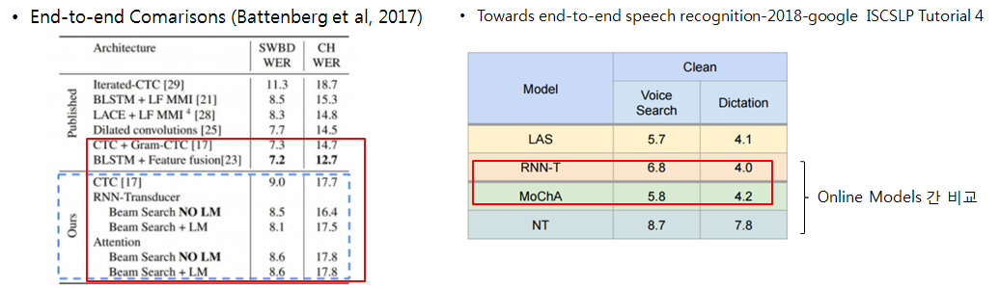

# Speech Recognition Study and Srcs

O speech_resnet_pytorch - my test code

O Jasper Pytorch + Specaugment (nvidia) 2019 
https://github.com/NVIDIA/DeepLearningExamples/tree/master/PyTorch/SpeechRecognition/Jasper

O OpenSeq2Seq(nvidia) : OpenSeq2Seq is a TensorFlow-based toolkit for sequence-to-sequence models (nvidia)
speech recognition?(DeepSpeech2, Wave2Letter, Jasper, …) language model?(LSTM, …)
speech commands?(RN-50, Jasper) speech synthesis(합성)?(Tacotron2, WaveNet…) machine translation?(GNMT, Transformer, ConvS2S, …)
sentiment analysis?(SST, IMDB, …) image classification?(ResNet-50)

https://nvidia.github.io/OpenSeq2Seq/html/speech-recognition.html
https://github.com/NVIDIA/OpenSeq2Seq

O ESPnet: end-to-end speech processing toolkit
https://github.com/espnet/espnet  CTC-Attention STT TTS

O LAS + Specaugment   
https://github.com/DemisEom/SpecAugment    A Implementation of SpecAugment with Tensorflow & Pytorch
https://github.com/KimJeongSun/SpecAugment_numpy_scipy  SpecAugment with numpy & scipy, 100 time faster than using tensorflow
https://github.com/Alexander-H-Liu/End-to-end-ASR-Pytorch  Listen, Attend and Spell - PyTorch Implementation + LM

O PyTorch Implementations for End-to-End Automatic Speech Recognition  RNN-T
https://github.com/HawkAaron/E2E-ASR   

O links
-AI hackerton 2019 (naver) STT Basecode : Sequence-to Sequence & Attention 
https://github.com/clovaai/speech_hackathon_2019
-Pytorch Tutorials : Sequence to Sequence Attention Translation 
https://9bow.github.io/PyTorch-tutorials-kr-0.3.1/intermediate/seq2seq_translation_tutorial.html
-deepspeech.pytorch : Implementation of DeepSpeech2 for PyTorch. 
https://github.com/SeanNaren/deepspeech.pytorch
-deepspeech2 korea pytorch   base deepspeech.pytorch
https://github.com/homink/deepspeech.pytorch.ko
-MXNet implementation of RNN Transducer (Graves 2012): Sequence Transduction with Recurrent Neural Networks RNN-T
https://github.com/HawkAaron/RNN-Transducer
-Fully Convolutional Speech Recognition 201812 2019 Apr FacebookAI Neil Zeghidour wav2letter++
https://github.com/facebookresearch/wav2letter

 
 
 
 
 
 

