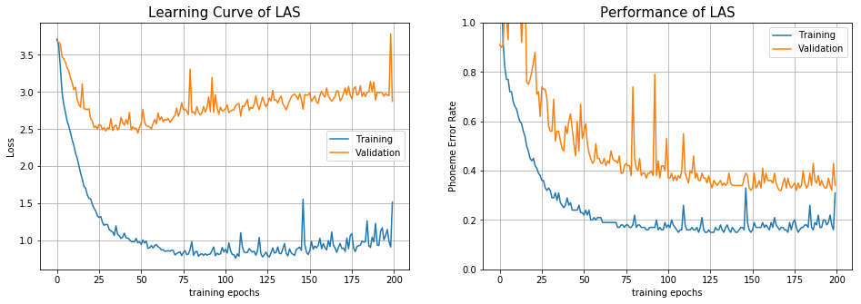
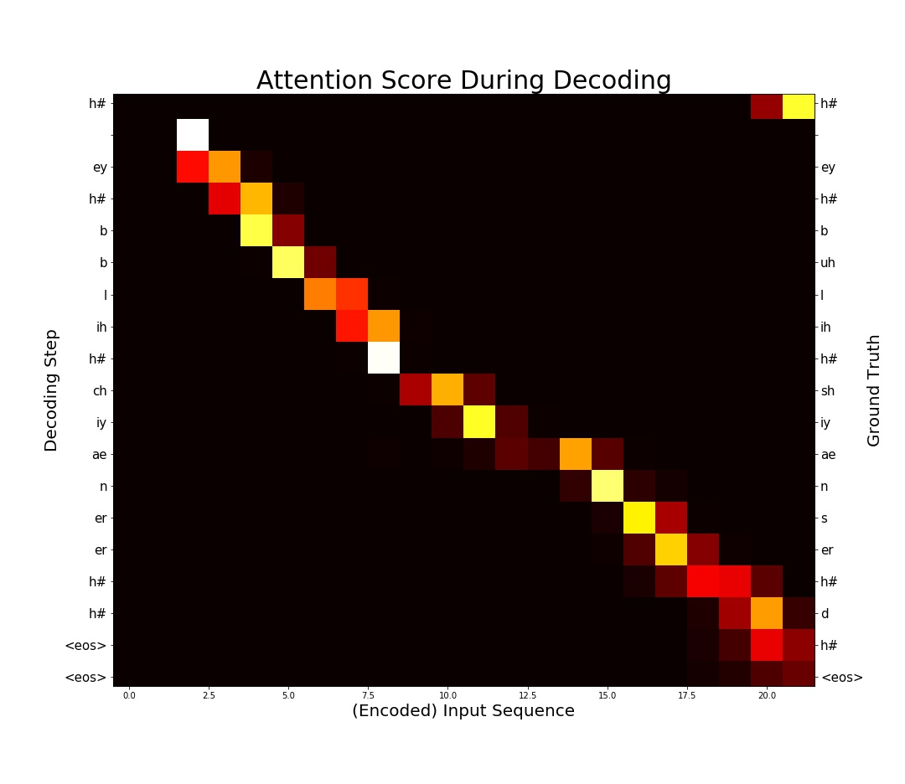

# Listen, Attend and Spell - Pytorch Implementation

## Description

This is a pytorch implementation of [Listen, Attend and Spell](https://arxiv.org/abs/1508.01211v2) (LAS)  published in ICASSP 2016 (Student Paper Award).
Please feel free to use/modify them, any bug report or improvment suggestion will be appreciated.

This implement achieves about 36% phoneme error rate on TIMIT's testing set (using original setting in the paper without hyper parameter tuning, models are stored in [`checkpoint/`](checkpoint/)). It's not a remarkable score but please notice that deep end2end ASR without special designed loss function such as LAS requires larger corpus to achieve outstanding performance.

#### Learning Curve

#### Attention Visualization & Recognition Result

Result of the first sample in TIMIT testing set.

#### Remarks

The input feature is mfcc 39 (13+delta+accelerate), and the output phoneme classes is reduced from 61 to 39 classes during evaluation.

Be aware of some difference between this implementation and the origianl proposed model:

- Smaller Dataset
    
    Originally, LAS was trained on Google's private voice search dataset representing 2000 hours of data plus additional data augmentation. Here the model was trained on [TIMIT](https://catalog.ldc.upenn.edu/ldc93s1), a MUCH smaller dataset, without any data augmentation.

- Different Target

    Evaluation criterion is [Word Error Rate (WER)](https://en.wikipedia.org/wiki/Word_error_rate) on the output phoneme (61 classes in TIMIT) sequence instead of real sentences composed of real words.

- Simplified Speller

    Speller contains a single layer LSTM instaed of 2 layer LSTM proposed. According to the reponse I got from a letter I wrote to the author, using single layer can get similar result.

If you have any questions, please contact b03902034[AT]ntu.edu.tw

## Requirements

##### Execution Environment

- python 3
- GPU computing is recommanded for training efficiency

##### Packages for TIMIT preprocessing

- [SoX](http://sox.sourceforge.net/)
    
    Command line tool for transforming raw wave file in TIMIT from NIST to RIFF

- [python_speech_features](https://github.com/jameslyons/python_speech_features)

    A python package for exarcting MFCC features during preprocessing
 
##### Packages for running LAS model

- [pytorch](http://pytorch.org/) (0.3.0 or later version)

    Please use pytorch after version 0.3.0 which the [softmax bug](https://github.com/pytorch/pytorch/issues/1020) on 3D input is fixed.

- [editdistance](https://github.com/aflc/editdistance)

    Package for calculating edit distance (Levenshtein distance).

    

## Setup
- TIMIT Dataset Preprocess

    Please prepare TIMIT dataset without modifying the file structure of it and run the following command to preprocess it from wave to mfcc 39 before training.
    
        ./timit_preprocess.sh <TIMIT folder>       
    
    After preprocessing step, `timit_mfcc_39.pkl` should be under your timit folder. Add your data path to config file.

- LAS Model
        
        mkdir -p checkpoint
        mkdir -p log
        python3 run_exp.py <config file path>
    
    Training log will be stored at `log/` while model checkpoint at ` checkpoint/`
    
    For a customized experiment, please read and modify [`config/las_example_config.yaml`](config/las_example_config.yaml)
    
    For more information and a simple demonstration, please refer to [`las_demo.ipynb`](las_demo.ipynb)

## ToDo

- Experiment on WSJ dataset
- Attention Visualize

## References
- Special thanks to [William Chan](http://williamchan.ca/), the first author of LAS, for answering my questions during implementation.
- TIMIT preprocessing : https://github.com/Faur/TIMIT
- 
